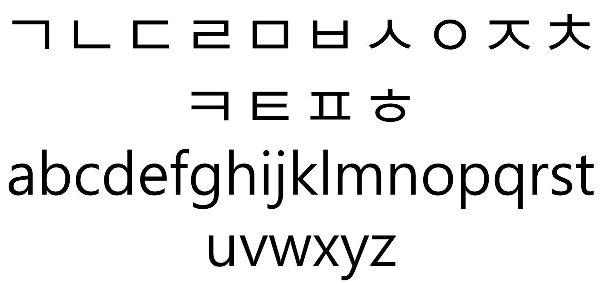
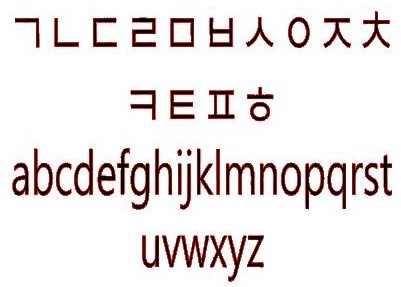
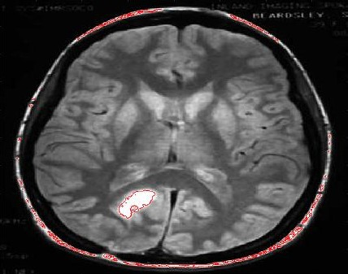

# 2-D Image Segmentation via Level Set Method

# About this Project
The goal of this project is to make an image segmentation program using level set technique. It is based on a paper written by T. Chan and L. Vese(2001).

# Algorithm
Key idea: Want to find a function on images whose zero level set cuts what we want to segment.

First, we have to define a functional that measures how well a function segments the image. Intuitively, we can map a function, whose zero level set is very far away from 'real segmentation curve', to a high value indicating it performs bad. Also we can map a function, whose zero level set is very close to the real, to a small value. And then, we need to solve the variational PDE to minimize the linear functional.

Mathematically, the functional is defined as follows.

&space;=&space;\mu&space;\Bigg\(\int_\Omega&space;\left&space;|&space;\nabla&space;H(\phi)&space;\right&space;|dx&space;\Bigg\)^p&plus;\nu&space;\int_\Omega&space;H(\phi)dx&space;\\&space;&plus;\lambda_1&space;\int_\Omega&space;\left&space;|&space;I-c_1&space;\right&space;|^2&space;H(\phi)&space;dx&space;&plus;\lambda_2&space;\int_\Omega&space;\left&space;|&space;I-c_2&space;\right&space;|^2&space;(1-H(\phi))&space;dx)

where H is a Heaviside function, I is an image, and c1, c2 are the
averages of the image in the regions where φ > 0 and φ < 0 respectively.

To minimize this functional, we use Level Set Method. If you want more detalis, see the [paper](https://pdfs.semanticscholar.org/48fa/5314ec19ae0b55084e64e51af8918100b6c4.pdf).

# How to run
There are 2 main files.
1. chanvese_basic.m: this is for bi-level image segmentation. It segments non-white area.
2. chanvese_medical.m: this is for medical image segmentation. It segments an area with pixels in a specific range.

To run the code.
1. First, put a image you want to segment into a folder named 'public'.
2. Change the name of image file in the code(Don't forget to write a whole path).
3. Adjust hyperparameters.
4. Run the code.

# Result
Here are some sample results.

   
    
   <b>Case 1. a set of letters(before)</b> 
 

 
 

   
    
   <b>Case 1. a set of letters(after)</b> 
 

 
 

   
    
   <b>Case 2. medical image(before)</b> 
 

 
 

   
    
   <b>Case 2. a medical image(after)</b> 

You can see the red curve segmenting some part of an image.

## Reference
[1] T. F. Chan and L. A. Vese, Active Contours Without Edges, IEEE TRANSACTIONS ON IMAGE PROCESSING, VOL. 10, NO. 2, FEBRUARY 2001

[2] Robert Crandall, Image Segmentation Using the Chan-Vese Algorithm, [https://pdfs.semanticscholar.org/48fa/5314ec19ae0b55084e64e51af8918100b6c4.pdf](https://pdfs.semanticscholar.org/48fa/5314ec19ae0b55084e64e51af8918100b6c4.pdf).

